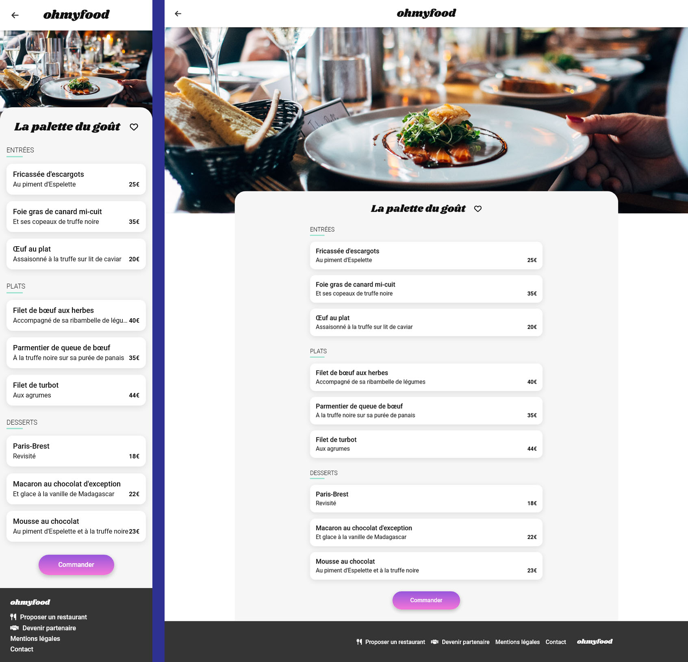
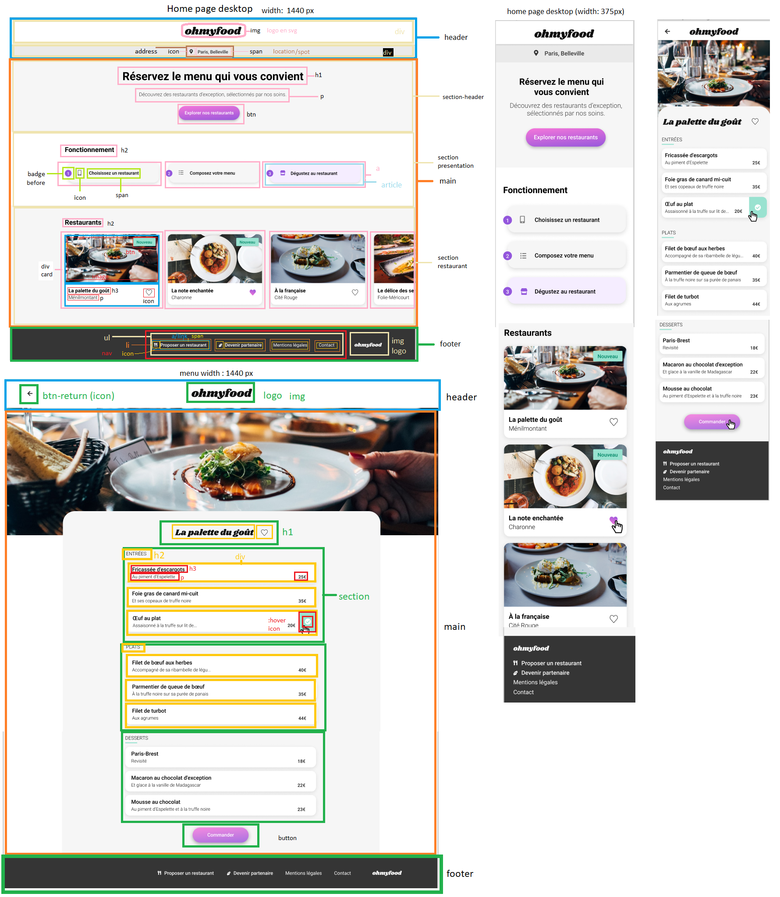

# OC Ohmyfood

Une démo du site [boysers.github.io/oc-ohmyfood](https://boysers.github.io/oc-ohmyfood/) .

## Screenshots

### Home page mobile and desktop :


### Menu Restaurant page mobile and desktop :



## Ressources

### Découpage de la maquette :



## Instructions d'installation

### ⌨️ Commandes:

Installation:

```
npm install
```

Exécuter sass:

```
npm run sass
```

Exécuter prettier pour formater:

```
npm run prettier
```

## Libraries

- sass
- prettier
